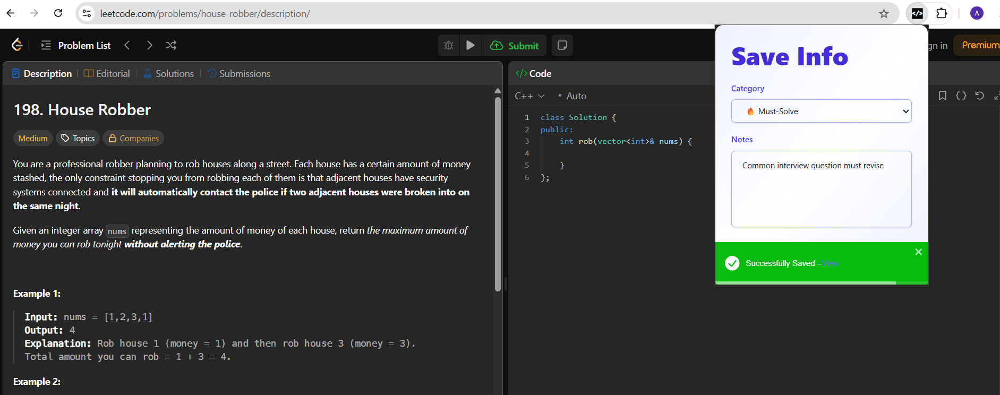
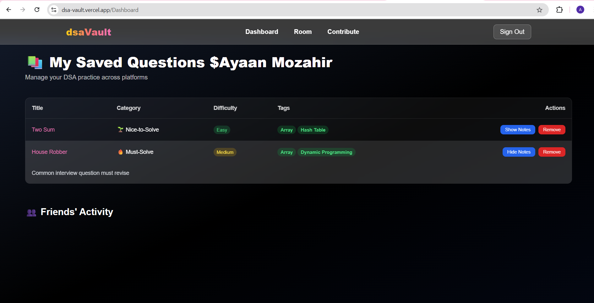
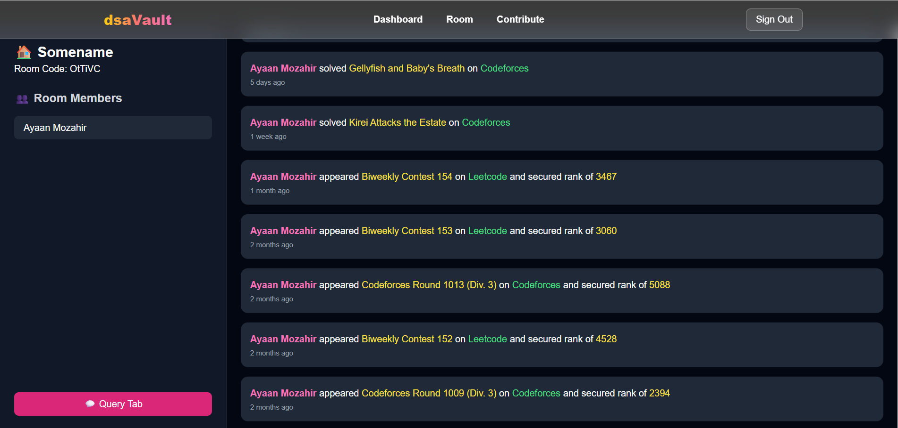
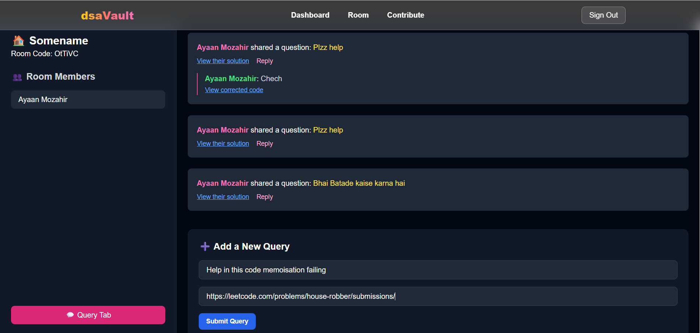

# 🧠 dsaVault (https://dsa-vault.vercel.app/)

A **full-stack DSA tracking and collaboration platform** that helps users save, organize, and discuss Data Structures & Algorithms problems from platforms like **LeetCode** and **Codeforces** with real-time study room features.

---

## 🚀 Overview

**dsaVault** bridges the gap between solving DSA problems and tracking learning progress. It consists of a **Chrome Extension** to save problem data and a **Next.js-based web app** for tracking, collaboration, and discussion — enabling a complete DSA learning ecosystem.

---

## 📌 Features

### 🔗 Chrome Extension
- Extracts problem data from LeetCode, Codeforces, and GFG with one click.
- Uses DOM parsing to get problem title, platform, URL, and status.
- Sends data securely to the backend using authenticated API calls.
- Google OAuth2 integration for secure user login via extension.

### 🌐 Web Dashboard (Next.js App)
- View all saved problems in a clean dashboard.
- Filter by platform, status (solved/unsolved/bookmarked), or search by title.
- Responsive design with Tailwind CSS for mobile and desktop.

### 🧑‍🤝‍🧑 Study Rooms
- Users can create or join collaborative rooms.
- Each room displays all members and their activities.
- Room-based activity feed showing problem submissions, contest participation, and queries.

### 📊 Contest & Submission Tracking
- Fetches recent submissions and contest participation via Codeforces API.
- Displays rating trends and contest history.
- Visual insights into learning consistency and competitive progress.

### ❓ Query & Discussion System
- Post DSA-related queries within a room.
- Share solutions, ask doubts, or help others with approach corrections.
- Real-time comment and response system.

### 💬 Real-Time Collaboration
- Built with Socket.IO to enable real-time updates inside study rooms.
- Instant visibility when members post queries, solve problems, or join rooms.

---

## 🧰 Tech Stack

### 🔧 Frontend
- **Next.js 14 (App Router)**
- **TypeScript**
- **Tailwind CSS**
- **React (for Chrome Extension)**

### 🧠 Backend
- **Next.js API Routes**
- **MongoDB + Mongoose**
- **Socket.IO**

### 🔐 Authentication
- **Google OAuth2**
- **JWT (ID Token)**

### 🌐 APIs & Integrations
- **Codeforces API**
- **Chrome Identity API**

---

## 🧪 How It Works

1. User logs in using Google Sign-In (via extension or web).
2. While solving a problem on LeetCode/Codeforces/GFG, user clicks the extension to save the problem.
3. Problem metadata is sent to the backend and saved in MongoDB.
4. User views saved problems on the dashboard.
5. Users can create/join study rooms to:
   - View member activity.
   - Ask DSA queries.
   - Collaborate and track progress in real time.

---

## 📸 Screenshots

### 🧩 Extension


### 🧩 Problem Dashboard


### 🧩 Activity Room


### 📚 Query & Discussion View


---


### 🔹 Web App
```bash
git clone https://github.com/yourusername/dsaVault.git
cd dsavault
npm install
npm run dev
